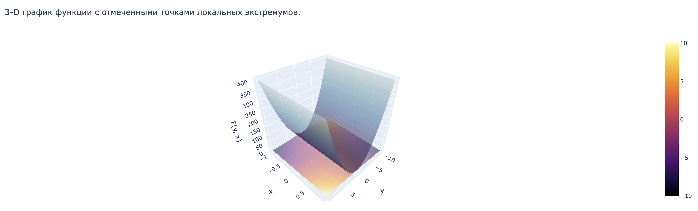

### Extremes_searching 
<html>
	<body>
		<h2>Оптимизационные задачи в машинном обучении.  Проект №1: Поиск экстремума ФНП</h2>
		

		<h3>Документация</h3>
		<h4>Проект <a href = "https://github.com/Romzezz/Extremes_searching">Extremes_searching</a> содержит следующий функционал: </h4>
		<h4>Внутрение функции, не предназначены для прямого вызова пользователем</h4>
		<h5>_get_hessian(func, args) - Возвращает матрицу Гессе входной функции по входным переменным.</h5>
		<h5>_take_input(ask_restriction=False) - Создаёт интерактивный ввод для пользователя и возвращает полученные данные в виде словаря.</h5>
		<h5> _make_real(points, args) - Функция проходит по всем входным точкам, и если у точки есть комплексное значение, оставляет только действительную часть.</h5>
		<h5>_check_point(hesse, point) - Функция делает вывод о типе экстремума входной точки с помощью определённости матрицы Гессе.</h5>
		<h5> _filter_points(args, points, bounds) - Отбирает те точки, которые лежат в пределах входных ограничений.</h5>
		<h5>_plot(func, points, bounds=None, restriction=None) -  Строит график входной и ограничивающей (если задана) функции отображает точки экстремумов на ней.</h5>
		<h4>Функции, предназначеные для прямого вызова пользователем</h4>
		<h5>find_local_extremas() - Находит точки экстремумов функции, строит её график и отображает на нём найденные точки.</h5>
		<h5>def lagrange() - Находит методом Лагранжа точки экстремумов функции, строит на графике исходную и ограничивающую функцию и отображает на ней найденные точки.</h5>
		<h5>Более подробно о кажой из функций можно узнать с помощью help(*Нужная функция*)</h5>
		

		<h3>Тестируем функцию поиска локальныx экстремумов функции двух переменных: </h3>
		<h5>Ввод параметров функции: </h5> 
		
		<h5>Вывод графика: </h5> 
		
		<h5>Вывод экстремумов функции с указанием типа : </h5> 
		
		

		<h3>Тестируем функцию поиска локальных экстремумов функции двух переменных с ограничениями (метод Лагранжа): </h3>
		<h5>Ввод параметров функции: </h5> 
		
		<h5>Вывод графика: </h5> 
		
		<h5>Вывод экстремумов функции с указанием типа : </h5> 
		
		<h3>Пример решения задач можно найти в  </h3>
		

		Участники проекта
		<ul>
		<h5>
		<li>Белоцерковский Даниил - Менеджер проектa</li>
		<li>Хасыков Бата - Программист</li>
		<li>Пучков Александр - Аналитик</li>
		<li>Поплевин Роман - Аналитик, Тестировщик</li>
		<li>Бады Денис - Тестировщик</li>
		</h5>
		<ul>
  </body>

</html>
Группа ПМ19-3
